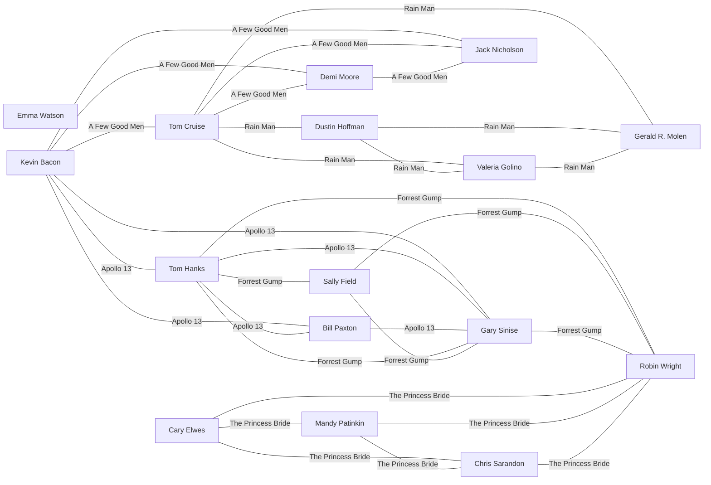

# Movie Connection Graph

```mermaid
graph LR
    EW["Emma Watson"]
    KB["Kevin Bacon"]
    TC["Tom Cruise"]
    CE["Cary Elwes"]
    TH["Tom Hanks"]
    MP["Mandy Patinkin"]
    DH["Dustin Hoffman"]
    CS["Chris Sarandon"]
    DM["Demi Moore"]
    JN["Jack Nicholson"]
    BP["Bill Paxton"]
    SF["Sally Field"]
    VG["Valeria Golino"]
    GM["Gerald R. Molen"]
    GS["Gary Sinise"]
    RW["Robin Wright"]
    
    %% A Few Good Men
    KB ---|"A Few Good Men"| TC
    KB ---|"A Few Good Men"| DM
    KB ---|"A Few Good Men"| JN
    TC ---|"A Few Good Men"| DM
    TC ---|"A Few Good Men"| JN
    DM ---|"A Few Good Men"| JN
    
    %% Apollo 13
    KB ---|"Apollo 13"| TH
    KB ---|"Apollo 13"| BP
    KB ---|"Apollo 13"| GS
    TH ---|"Apollo 13"| BP
    TH ---|"Apollo 13"| GS
    BP ---|"Apollo 13"| GS
    
    %% Rain Man
    TC ---|"Rain Man"| DH
    TC ---|"Rain Man"| VG
    TC ---|"Rain Man"| GM
    DH ---|"Rain Man"| VG
    DH ---|"Rain Man"| GM
    VG ---|"Rain Man"| GM
    
    %% Forrest Gump
    TH ---|"Forrest Gump"| SF
    TH ---|"Forrest Gump"| GS
    TH ---|"Forrest Gump"| RW
    SF ---|"Forrest Gump"| GS
    SF ---|"Forrest Gump"| RW
    GS ---|"Forrest Gump"| RW
    
    %% The Princess Bride
    CE ---|"The Princess Bride"| MP
    CE ---|"The Princess Bride"| CS
    CE ---|"The Princess Bride"| RW
    MP ---|"The Princess Bride"| CS
    MP ---|"The Princess Bride"| RW
    CS ---|"The Princess Bride"| RW
    
    EW
```
